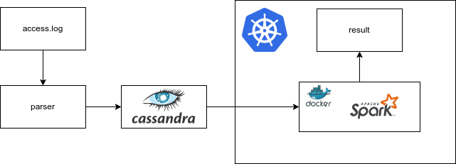

# Analysis of Apache logs

<div align="center">


</div>

## Description of the project with requirements

General task: to create a script for creating a showcase based on the web site logs.

<details>
  <summary>Detailed description of the task</summary>

Develop a script for creating a showcase with the following content:
1. Device surrogate key
1. Device name
1. Number of users
1. The share of users of this device from the total number of users.
1. Number of completed actions for this device
1. Percentage of completed actions from this device relative to other devices
1. A list of the 5 most popular browsers used on this device by various users, indicating the share of use for this browser relative to other browsers.
1. The number of server responses other than 200 on this device
1. For each of the server responses other than 200, create a field that will contain the number of responses of this type

Sources:

https://disk.yandex.ru/d/BsdiH3DMTHpPrw

</details>

## Implementation plan

### Technologies used
Technology stack - Apache Spark, Cassandra, Python.

The file system used is the regular file system of the host machine.

### Diagram



The program can work in two modes

1. Initializing

     If you set the variable **data_loading_mode=DataLoadingMode.Initializing** in **parser.py**, then the **access.log** file will be converted into a csv file for subsequent loading using Cassandra (using the COPY method).

2. Incremental

     If you set the variable **data_loading_mode=DataLoadingMode.Incremental** in **parser.py**, then the **access.log** file will be loaded into Cassandra directly from the parser.

After loading into Cassandra, Spark can already take data and build storefronts, saving the result.

### Setup and launch

#### Cassandra

Useful links:
- https://cassandra.apache.org/doc/latest/cassandra/getting_started/installing.html
- https://docs.datastax.com/en/developer/python-driver/3.25/getting_started/
- https://github.com/datastax/spark-cassandra-connector
- https://stackoverflow.com/questions/69027126/how-do-i-connect-to-cassandra-with-dbeaver-community-edition

```bash
bin/cassandra
bin/nodetool status
bin/cqlsh
```

Table creation:

```sql
CREATE KEYSPACE my_keyspace WITH replication = {'class': 'SimpleStrategy', 'replication_factor': 1};

USE my_keyspace;

CREATE TABLE apache_logs (
    remote_host text,
    remote_logname text,
    remote_user text,
    request_time timestamp,
    request_line text,
    final_status int,
    bytes_sent int,
    user_agent text,
    device_family text,
    device_brand text,
    device_model text,
    browser_family text,
    browser_version text,
    is_mobile boolean,
    is_tablet boolean,
    is_pc boolean,
    is_bot boolean,
    PRIMARY KEY (remote_host, request_time)
);
```

Loading CSV in case of initializing load:

```sql
COPY apache_logs(remote_host, remote_logname, remote_user, request_time, request_line, final_status, bytes_sent, user_agent, device_family, device_brand, device_model, browser_family, browser_version, is_mobile, is_tablet, is_pc, is_bot) FROM 'apache logs path' WITH DELIMITER=',' AND HEADER=TRUE;
```

#### Kubernetes

minikube version: v1.28.0

<details>
  <summary>Example</summary>

```bash
minikube start --driver=docker --mount --mount-string "/dir/to/share:/tmp/apache_logs_analysis"

docker build -f ./docker/Dockerfile -t izair/apache_logs_analysis:1.0.4 .
docker push izair/apache_logs_analysis:1.0.4

minikube ssh docker pull izair/apache_logs_analysis:1.0.4

export VOLUME_TYPE=hostPath
export VOLUME_NAME=demo-host-mount
export MOUNT_PATH=/tmp/apache_logs_analysis

kubectl proxy

spark-submit \
  --master=k8s://http://127.0.0.1:8001 \
  --deploy-mode cluster \
  --name apache_logs_analysis \
  --class org.example.App \
  --conf "spark.kubernetes.container.image=izair/apache_logs_analysis:1.0.4" \
  --conf spark.kubernetes.driver.volumes.$VOLUME_TYPE.$VOLUME_NAME.mount.path=$MOUNT_PATH \
  --conf spark.kubernetes.driver.volumes.$VOLUME_TYPE.$VOLUME_NAME.options.path=$MOUNT_PATH \
  --conf spark.kubernetes.executor.volumes.$VOLUME_TYPE.$VOLUME_NAME.mount.path=$MOUNT_PATH \
  --conf spark.kubernetes.executor.volumes.$VOLUME_TYPE.$VOLUME_NAME.options.path=$MOUNT_PATH \
  --conf spark.executor.instances=1 \
  --conf spark.driver.memory=512m \
  --conf spark.executor.memory=512m \
  --conf spark.driver.cores=1 \
  --conf spark.executor.cores=1 \
  --conf spark.kubernetes.namespace=default \
  local:///opt/apache_logs_analysis-1.0-jar-with-dependencies.jar

minikube dashboard
```
</details>

## Development results
As a result, a project was created with the following structure:
```bash
.
├── cassandra                  # cassandra commands
├── data                       # data files
├── docs                       # documentation
├── images                     # screenshots
├── python                     # python source files
├── spark                      # spark source files
└── README.md
```

<details>
  <summary>Data mart example</summary>

  

</details>